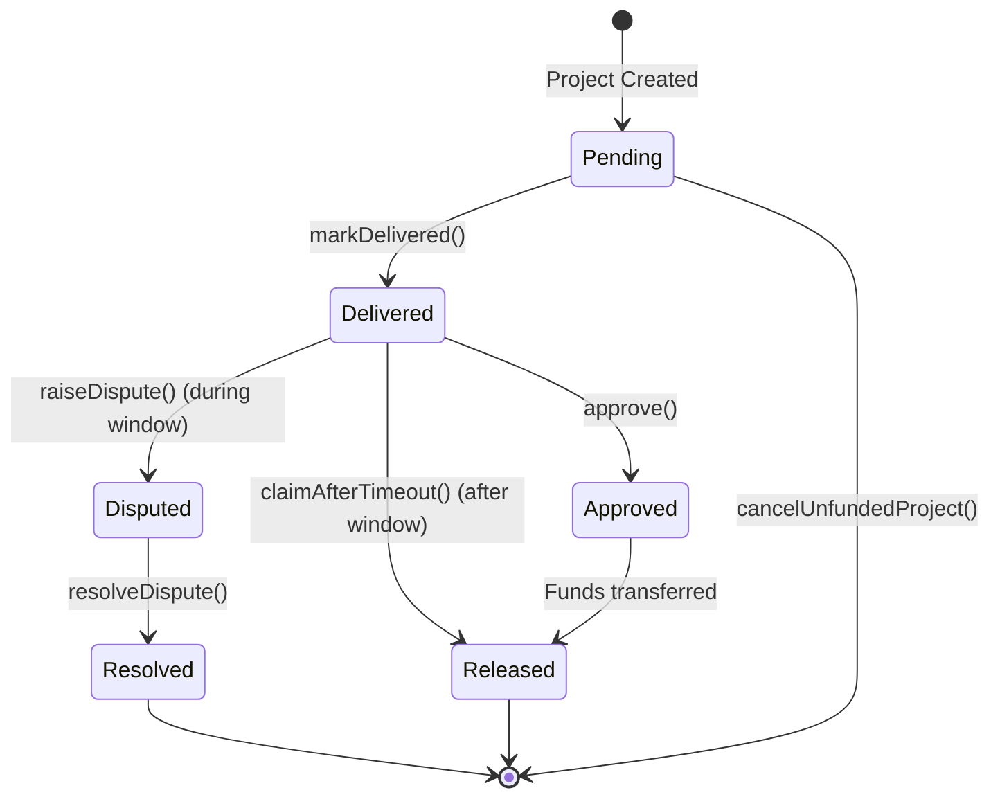

# Vaultwork - Milestone Escrow for Freelance Payments

A trust-minimized escrow system for freelance milestone payments on Base Sepolia, built with Solidity smart contracts and a React frontend.

[](https://opensource.org/licenses/MIT)
[](https://soliditylang.org/)
[](https://www.base.org/)
[](https://reactjs.org/)
[](https://vitejs.dev/)
[](https://getfoundry.sh/)

## Architecture Overview

Vaultwork uses a factory pattern with EIP-1167 minimal proxies for gas-efficient deployment of escrow contracts.

### Smart Contracts

#### MilestoneEscrow.sol
Core escrow contract that manages milestone-based payments between a client and freelancer.

**Key Features:**
- Client deposits total escrow amount after project creation
- Freelancer marks milestones as delivered
- Client approves milestones to release payments
- Auto-release after review window expires (default 7 days)
- Dispute resolution via trusted arbiter
- Reentrancy protection using OpenZeppelin's ReentrancyGuard
- SafeERC20 for secure token transfers

**State Machine:**
```
Pending → Delivered → (approve) → Approved/Released
                  → (timeout) → Released
                  → (raiseDispute) → Disputed → (resolveDispute) → Resolved
```

#### EscrowFactory.sol
Factory contract that deploys MilestoneEscrow instances using EIP-1167 minimal proxies for gas efficiency. Provides indexing functions for querying escrows by participant.

**Key Features:**
- Deploys minimal proxy clones of MilestoneEscrow
- Maintains mappings of escrows by client and freelancer
- Emits ProjectCreated events for off-chain indexing
- Transferable ownership

### Frontend

Built with React, Vite, Tailwind CSS, wagmi, and viem for Web3 integration. Uses RainbowKit for wallet connection UI.

**Pages:**
- **Landing**: Product explainer with wallet connection
- **Dashboard**: Lists all projects for connected wallet
- **Create Project**: Form to create new escrow projects
- **Project Detail**: View milestones and execute contract actions

**Design:**
- Dark theme with slate/charcoal background (#0F1115)
- Modern, clean UI with Tailwind CSS
- Color-coded milestone states:
  - Emerald green (#10B981) for approved/released
  - Amber (#F59E0B) for pending/awaiting review
  - Red (#EF4444) for disputes
- Clean, utilitarian UI optimized for financial interactions

## State Diagram



## Installation

### Prerequisites
- Node.js 18+ for frontend development
- Foundry for smart contract development
- Git for version control (optional, for contract testing/deployment)

### Smart Contracts

1. Install Foundry (if not already installed):
```bash
curl -L https://foundry.paradigm.xyz | bash
```

2. Install OpenZeppelin contracts:
```bash
forge install OpenZeppelin/openzeppelin-contracts
```

3. Run tests:
```bash
forge test
```

4. Check coverage:
```bash
forge coverage
```

### Frontend

1. Install dependencies:
```bash
cd frontend
npm install
```

2. Set up environment variables:
```bash
cp ../.env.example .env
```
Edit `.env` with your WalletConnect project ID from https://cloud.walletconnect.com/

3. Run development server:
```bash
npm run dev
```
The app will be available at http://localhost:3000

4. Build for production:
```bash
npm run build
```

## Deployment

### Deploy to Base Sepolia

1. Deploy the implementation and factory:
```bash
export RPC_URL=https://sepolia.base.org
export PRIVATE_KEY=your_private_key
```

2. Run deployment script:
```bash
forge script script/Deploy.s.sol --rpc-url $RPC_URL --broadcast --verify -e
```
The `-e` flag enables Etherscan verification on Base Sepolia.

3. Update frontend with deployed factory address:
Edit `frontend/src/pages/Dashboard.jsx`, `frontend/src/pages/CreateProject.jsx`, and `frontend/src/pages/ProjectDetail.jsx` to replace the placeholder factory address.

### Verify on Basescan

```bash
forge verify-contract <FACTORY_ADDRESS> src/EscrowFactory.sol:EscrowFactory --chain-id 84532
```
Replace `<FACTORY_ADDRESS>` with the deployed factory address from the deployment output.

## Usage

### Creating a Project

1. Connect wallet as client
2. Navigate to "Create Project"
3. Enter freelancer address, arbiter address, and milestone details
4. Approve USDC spending and confirm transaction
5. Project is created and appears in dashboard
6. Fund the project by transferring the total escrow amount

### Managing Milestones

**As Freelancer:**
- Mark milestones as delivered when work is complete
- Claim funds after review window expires if client doesn't respond

**As Client:**
- Review delivered milestones
- Approve to release payment or raise dispute if issues exist
- Disputes must be raised within the review window (default 7 days)

**As Arbiter:**
- Resolve disputed milestones by splitting funds between parties
- Use basis points (0-10000) to determine client vs freelancer split

## Testing

The test suite covers:
- Happy path (fund → deliver → approve → release)
- Timeout auto-release
- Dispute resolution with partial split
- Access control failures
- Reentrancy attack simulation
- Edge cases (double-approve, approve before delivery, etc.)
- Factory pattern and minimal proxy deployment

Run tests:
```bash
forge test
```

Run with coverage:
```bash
forge coverage --report lcov
```
View coverage report:
```bash
genhtml lcov.info -o coverage
open coverage/index.html
```

## Known Limitations

See [KNOWN_LIMITATIONS.md](KNOWN_LIMITATIONS.md) for v1 scope cuts and future improvements.

## Security

- Uses OpenZeppelin's audited contracts (ReentrancyGuard, SafeERC20, Ownable)
- Checks-effects-interactions pattern on all fund-moving functions
- Reentrancy protection on critical functions
- Access control on all state-changing functions
- Integer overflow protection (Solidity ^0.8.20)
- Security contact: security@vaultwork.io

## License

MIT License - see [LICENSE](LICENSE) file for details.

## Contributing

Contributions are welcome! Please open an issue or submit a pull request.

## Support

For support, please open an issue on GitHub or contact security@vaultwork.io for security-related matters.
