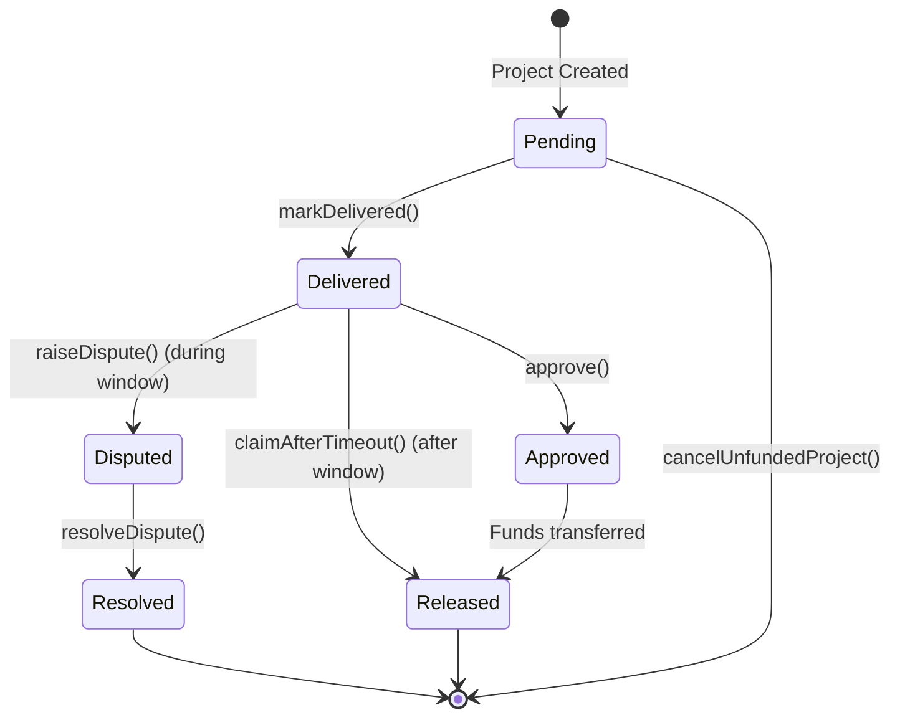

# Vaultwork - Milestone Escrow for Freelance Payments

A trust-minimized escrow system for freelance milestone payments on Stellar, built with Soroban smart contracts (Rust) and a React frontend.

[](https://opensource.org/licenses/MIT)
[](https://www.rust-lang.org/)
[](https://www.stellar.org/)
[](https://reactjs.org/)
[](https://vitejs.dev/)

## Architecture Overview

Vaultwork uses Soroban smart contracts for milestone-based escrow payments between clients and freelancers on the Stellar network.

### Smart Contracts

#### MilestoneEscrow (Rust/Soroban)
Core escrow contract that manages milestone-based payments between a client and freelancer.

**Key Features:**
- Client deposits total escrow amount after project creation
- Freelancer marks milestones as delivered
- Client approves milestones to release payments
- Auto-release after review window expires (default 7 days)
- Dispute resolution via trusted arbiter
- Built with soroban-sdk for Stellar smart contract development

**State Machine:**
```
Pending → Delivered → (approve) → Approved/Released
                  → (timeout) → Released
                  → (raiseDispute) → Disputed → (resolveDispute) → Resolved
```

#### EscrowFactory (Rust/Soroban)
Factory contract that deploys MilestoneEscrow instances. Provides indexing functions for querying escrows by participant.

**Key Features:**
- Deploys MilestoneEscrow contracts
- Maintains mappings of escrows by client and freelancer
- Emits ProjectCreated events for off-chain indexing
- Transferable ownership

### Frontend

Built with React, Vite, Tailwind CSS, and Stellar SDK for Web3 integration. Uses Freighter wallet for Stellar wallet connection.

**Pages:**
- **Landing**: Product explainer with wallet connection
- **Dashboard**: Lists all projects for connected wallet
- **Create Project**: Form to create new escrow projects
- **Project Detail**: View milestones and execute contract actions

**Design:**
- Dark theme with slate/charcoal background (#0F1115)
- Modern, clean UI with Tailwind CSS
- Color-coded milestone states:
  - Emerald green (#10B981) for approved/released
  - Amber (#F59E0B) for pending/awaiting review
  - Red (#EF4444) for disputes
- Clean, utilitarian UI optimized for financial interactions

## State Diagram



## Installation

### Prerequisites
- Node.js 18+ for frontend development
- Rust 1.70+ for Soroban smart contract development
- stellar-cli for Soroban contract deployment
- Freighter wallet extension for Stellar wallet connection

### Smart Contracts

1. Install Rust (if not already installed):
```bash
curl --proto '=https' --tlsv1.2 -sSf https://sh.rustup.rs | sh
```

2. Install stellar-cli:
```bash
cargo install stellar-cli
```

3. Build contracts:
```bash
cd contracts/milestone_escrow
cargo build --target wasm32-unknown-unknown --release

cd ../escrow_factory
cargo build --target wasm32-unknown-unknown --release
```

4. Run tests:
```bash
cd contracts/milestone_escrow
cargo test

cd ../escrow_factory
cargo test
```

### Frontend

1. Install dependencies:
```bash
cd frontend
npm install
```

2. Run development server:
```bash
npm run dev
```
The app will be available at http://localhost:3000

3. Build for production:
```bash
npm run build
```

## Deployment

### Deploy to Stellar Testnet

1. Configure Stellar network:
```bash
stellar network switch testnet
```

2. Deploy MilestoneEscrow contract:
```bash
cd contracts/milestone_escrow
stellar contract deploy --wasm target/wasm32-unknown-unknown/release/milestone_escrow.wasm
```

3. Deploy EscrowFactory contract:
```bash
cd contracts/escrow_factory
stellar contract deploy --wasm target/wasm32-unknown-unknown/release/escrow_factory.wasm --source <YOUR_WALLET_ADDRESS> -- --owner <YOUR_WALLET_ADDRESS>
```

4. Update frontend with deployed factory address:
Edit `frontend/src/pages/Dashboard.jsx`, `frontend/src/pages/CreateProject.jsx`, and `frontend/src/pages/ProjectDetail.jsx` to replace the placeholder factory address.

## Usage

### Creating a Project

1. Connect Freighter wallet as client
2. Navigate to "Create Project"
3. Enter freelancer address (Stellar public key), arbiter address, and milestone details
4. Approve token spending and confirm transaction
5. Project is created and appears in dashboard
6. Fund the project by transferring the total escrow amount

### Managing Milestones

**As Freelancer:**
- Mark milestones as delivered when work is complete
- Claim funds after review window expires if client doesn't respond

**As Client:**
- Review delivered milestones
- Approve to release payment or raise dispute if issues exist
- Disputes must be raised within the review window (default 7 days)

**As Arbiter:**
- Resolve disputed milestones by splitting funds between parties
- Use basis points (0-10000) to determine client vs freelancer split

## Testing

The test suite covers:
- Happy path (fund → deliver → approve → release)
- Timeout auto-release
- Dispute resolution with partial split
- Access control failures
- Edge cases (double-approve, approve before delivery, etc.)
- Factory pattern and contract deployment

Run tests:
```bash
cd contracts/milestone_escrow
cargo test

cd contracts/escrow_factory
cargo test
```

## Known Limitations

- Token integration needs to be implemented with Stellar SEP-41 token standard
- Cross-contract calls for token transfers need to be added
- Frontend Stellar SDK integration is currently using placeholder data
- Deployment scripts need to be created for automated deployment

## Security

- Uses soroban-sdk for secure Stellar smart contract development
- Access control on all state-changing functions
- Proper error handling with custom error types
- Security contact: security@vaultwork.io

## License

MIT License - see [LICENSE](LICENSE) file for details.

## Contributing

Contributions are welcome! Please open an issue or submit a pull request.

## Support

For support, please open an issue on GitHub or contact security@vaultwork.io for security-related matters.
